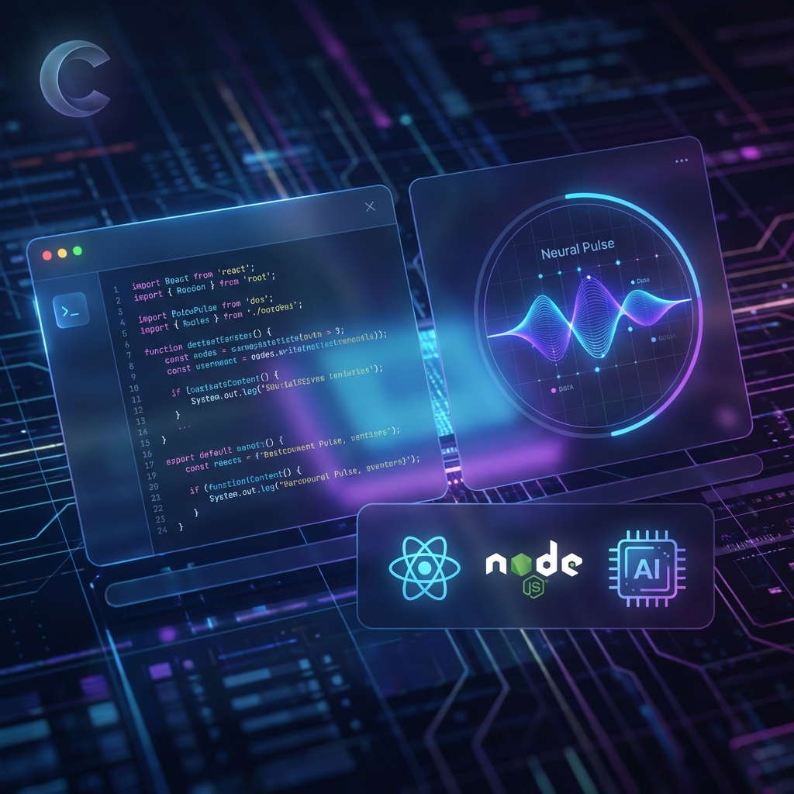
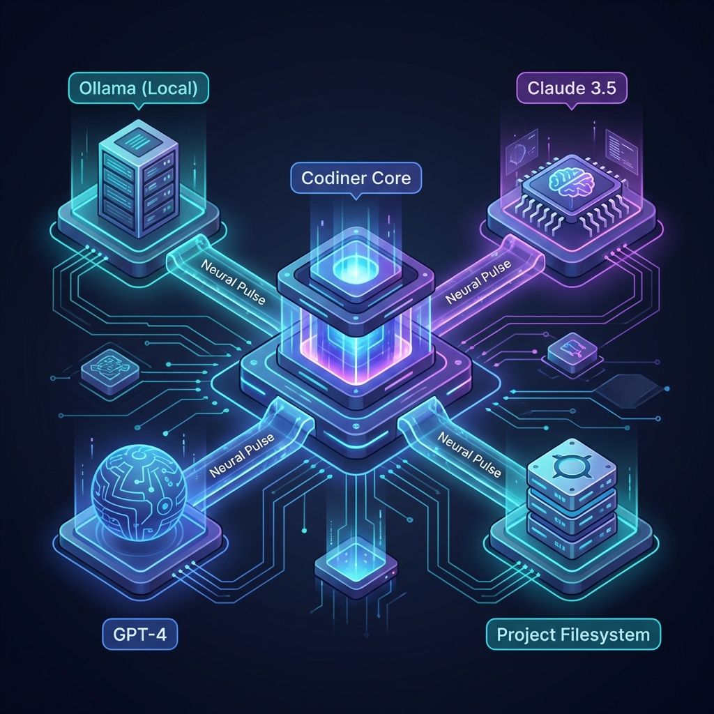
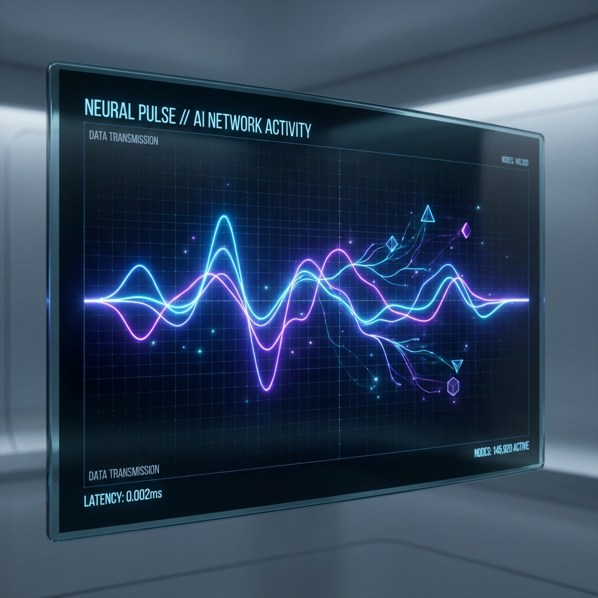

#  Codiner

<div align="center">

**The Free, Local-First, Open-Source AI Application Foundry**

[](https://opensource.org/licenses/MIT)
[](https://www.electronjs.org/)
[](https://nodejs.org/)
[](https://www.typescriptlang.org/)

*Build full-stack modern web applications in seconds using local AI, powerful templates, and real-time neural diagnostics.*

[🚀 Quick Start](#-quick-start) • [⚡ How it Works](#-how-it-works) • [🔒 Privacy & Security](#-privacy--security-first) • [🏗️ Template Foundry](#-the-template-foundry) • [🧠 Neural Pulse](#-neural-pulse-architecture)



</div>

---

## ⚡ How it Works: The Architecture

Codiner is built as a **Secure Desktop Hub**. It acts as the "Grand Central Station" between your code, your local AI models, and your cloud infrastructure.

<div align="center">
  
</div>

### 1. The Core Engine (Electron + IPC)
Codiner runs as a multi-process Electron application. The **Renderer** (the UI you see) communicates with the **Main Process** via a secure **IPC (Inter-Process Communication) Bridge**.
- **Direct Filesystem Access**: Unlike web-based builders, Codiner manipulates your code directly on your disk.
- **SQLite Persistence**: All your project data and integration keys are locked in a local, lightning-fast database.

### 2. AI Orchestration
- **Neural Handshake**: Every request is verified against the provider's health before execution.
- **Atomicity**: Changes are staged and validated before being applied to your source files.

---

## 🔒 Privacy & Security First

Codiner was born out of the need for **confidential AI development**. Your intellectual property should never be training data for a third party.

<div align="center">
  
</div>

- **Local Inference Support**: Deeply optimized for **Ollama**. Run Llama 3 or Codestral without an internet connection.
- **Zero-Data-Retention**: Codiner doesn't have a backend server. We don't track your code, your prompts, or your projects.
- **Encrypted Keys**: Your API keys for cloud providers are stored using industry-standard encryption, accessible only by the local Codiner process.
- **Audit Logs**: Every AI-driven file change is logged locally, so you can review exactly what was modified and when.

---

## 🏗️ The Template Foundry

Stop wasting hours on boilerplate. Codiner includes a curated gallery of **22+ verified, production-ready templates**.

<div align="center">
  
</div>

### 🌐 Web Frameworks
- **React (Official)**: Next-gen React 19 template with Vite, Shadcn/UI, and built-in SEO audit tools.
- **Next.js 14**: Full-stack starter with App Router, server actions, and TypeScript.
- **Vue 3 & Svelte 5**: Modern reactive starters with Tailwind CSS and optimized build pipelines.
- **Qwik & SolidJS**: Focusing on maximum performance and minimal bundles.

### 📱 Mobile & Desktop
- **Universal Mobile**: React Native + Expo for iOS and Android deployment.
- **Native Desktop**: Tauri (Rust-based) and Electron starters for high-performance desktop apps.

### 🔌 Ready-to-Scale APIs
- **NextJS/NestJS**: Enterprise-grade backend architectures.
- **Hono/Fastify**: Lightweight, high-speed API foundations.

---

## 🧠 Neural Pulse Architecture
Our signature AI diagnostic suite. It's the "cockpit" of your AI development.

| Component | What it Monitors | Why it Matters |
|:--- |:--- |:--- |
| **Connectivity Orbs** | Real-time status of all AI nodes. | Instant visual confirmation if a service goes down. |
| **Neural Latency** | Time-to-first-token and round-trip ping. | Choose the fastest provider for the task at hand. |
| **Capability Matrix** | Vision, Tool-use, and Context Window size. | Automatically routes complex visual tasks. |
| **Smart Diagnostics** | Translates cryptic errors to plain English. | Fix "Rate Limit" or "Invalid Key" issues in seconds. |

<div align="center">
  
</div>

---

## 🚀 Infrastructure & Integrations

Codiner configures your entire production environment with one click.

- **Databases**: Zero-config setup for **Supabase**, **Firebase**, and **Neon DB**.
- **Deployment**: Integrated workflows for **Vercel** and **Docker**.
- **Business**: Pre-configured modules for **Stripe** (Payments) and **Slack** (Notifications).

---

## 🛠️ Tech Stack

<div align="center">

| Area | Technologies |
| :--- | :--- |
| **Core** |    |
| **Storage** |   |
| **AI Hub** |     |

</div>

---

## 🚀 Quick Start

```bash
# Clone the repository
git clone https://github.com/setupg963-spec/Codiner-Software.git
cd Codiner-Software

# Install and Ignition
npm install && npm start
```

---

## 🤝 Community & Support

- **Bug Reports**: Use the [Issues](https://github.com/setupg963-spec/Codiner-Software/issues) tab.
- **Contributing**: Check out [CONTRIBUTING.md](CONTRIBUTING.md) to join the mission.

---

<div align="center">
  <p>Built with ❤️ by the Codiner Team.</p>
  <p><b>⭐ Star us on GitHub to support local AI!</b></p>
</div>
