#  Codiner

<div align="center">

**The Free, Local-First, Open-Source AI Application Foundry**

[](https://opensource.org/licenses/MIT)
[](https://github.com/Subhan-Haider/Codiner-Software/actions/workflows/ci.yml)
[](https://www.electronjs.org/)
[](https://nodejs.org/)
[](https://www.typescriptlang.org/)

*Build full-stack modern web applications in seconds using local AI, powerful templates, and real-time neural diagnostics.*

[🚀 Quick Start](#-quick-start) • [⚡ How it Works](#-how-it-works) • [🔒 Privacy](#-privacy--security-first) • [🏗️ Foundry](#-the-template-foundry) • [🧠 Pulse](#-neural-pulse-architecture) • [🤖 Automation](#-automation--cicd) • [🏙️ Liberty](https://github.com/Subhan-Haider/Codiner-Liberty)


</div>

---

## ⚡ How it Works: The Architecture

Codiner is built as a **Secure Desktop Hub**. It acts as the "Grand Central Station" between your code, your local AI models, and your cloud infrastructure.

<div align="center">
  
</div>

### 1. The Core Engine (Electron + IPC)
Codiner runs as a multi-process Electron application. The **Renderer** (the UI you see) communicates with the **Main Process** via a secure **IPC (Inter-Process Communication) Bridge**.
- **Direct Filesystem Access**: Unlike web-based builders, Codiner manipulates your code directly on your disk.
- **SQLite Persistence**: All your project data and integration keys are locked in a local, lightning-fast database.

### 2. AI Orchestration
- **Neural Handshake**: Every request is verified against the provider's health before execution.
- **Atomicity**: Changes are staged and validated before being applied to your source files.

---

## 🔒 Privacy & Security First

Codiner was born out of the need for **confidential AI development**. Your intellectual property should never be training data for a third party.

<div align="center">
  
</div>

- **Local Inference Support**: Deeply optimized for **Ollama**. Run Llama 3 or Codestral without an internet connection.
- **Zero-Data-Retention**: Codiner doesn't have a backend server. We don't track your code, your prompts, or your projects.
- **Encrypted Keys**: Your API keys for cloud providers are stored using industry-standard encryption, accessible only by the local Codiner process.
- **Audit Logs**: Every AI-driven file change is logged locally, so you can review exactly what was modified and when.

---

## 🏗️ The Template Foundry

Stop wasting hours on boilerplate. Codiner includes a curated gallery of **22+ verified, production-ready templates**.

<div align="center">
  
</div>

### 🌐 Web Frameworks
- **React (Official)**: Next-gen React 19 template with Vite, Shadcn/UI, and built-in SEO audit tools.
- **Next.js 14**: Full-stack starter with App Router, server actions, and TypeScript.
- **Vue 3 & Svelte 5**: Modern reactive starters with Tailwind CSS and optimized build pipelines.
- **Qwik & SolidJS**: Focusing on maximum performance and minimal bundles.

### 📱 Mobile & Desktop
- **Universal Mobile**: React Native + Expo for iOS and Android deployment.
- **Native Desktop**: Tauri (Rust-based) and Electron starters for high-performance desktop apps.

### 🔌 Ready-to-Scale APIs
- **NextJS/NestJS**: Enterprise-grade backend architectures.
- **Hono/Fastify**: Lightweight, high-speed API foundations.

---

## 🧠 Neural Pulse Architecture
Our signature AI diagnostic suite. It's the "cockpit" of your AI development.

| Component | What it Monitors | Why it Matters |
|:--- |:--- |:--- |
| **Connectivity Orbs** | Real-time status of all AI nodes. | Instant visual confirmation if a service goes down. |
| **Neural Latency** | Time-to-first-token and round-trip ping. | Choose the fastest provider for the task at hand. |
| **Capability Matrix** | Vision, Tool-use, and Context Window size. | Automatically routes complex visual tasks. |
| **Smart Diagnostics** | Translates cryptic errors to plain English. | Fix "Rate Limit" or "Invalid Key" issues in seconds. |

<div align="center">
  
</div>

---

## 🚀 Infrastructure & Integrations

Codiner configures your entire production environment with one click.

- **Databases**: Zero-config setup for **Supabase**, **Firebase**, and **Neon DB**.
- **Deployment**: Integrated workflows for **Vercel** and **Docker**.
- **Business**: Pre-configured modules for **Stripe** (Payments) and **Slack** (Notifications).

---

## 🛠️ Tech Stack

<div align="center">

| Area | Technologies |
| :--- | :--- |
| **Core** |    |
| **Storage** |   |
| **AI Hub** |     |

</div>

---

## 🏛️ Why Local-First AI?

The modern developer's greatest asset is their code. In an era where cloud AI models are trained on everything they ingest, **Privacy is not a luxury—it's a requirement.**

Codiner was built on three core pillars:
1.  **Sovereignty**: Your source code stays on your hardware. By default, Codiner prioritizes local inference models (like Llama 3) that run entirely without an internet connection.
2.  **Zero Latency**: Cloud-based AI builders are bottlenecked by network speeds. Codiner talks to your local filesystem and local AI instances at the speed of your internal bus (NVMe).
3.  **Extensibility**: Every project built with Codiner is **standard, clean code**. No proprietary lock-in, no hidden runtimes, and no "black-box" magic. Just pure industry-standard React, Vue, or TypeScript.

---

## 🧪 Advanced Use Cases

Codiner isn't just for building "Hello World" apps. It's engineered for professional software production:

### 💼 Enterprise Prototypes
Rapidly scaffold high-fidelity prototypes that use real production infrastructure (Supabase, Neon) without needing a dedicated DevOps team.

### 🛡️ Secure Finance & Health Apps
Build applications that handle sensitive PII (Personally Identifiable Information) with the peace of mind that no code context is being leaked to external servers.

### 🎓 Educational Lab
Experiment with different AI models (Claude vs. GPT vs. Llama) to see how they handle the same codebase, right inside the integrated "Neural Pulse" monitor.

---

## 🏗️ Technical Deep-Dive

### The File System Guard
Whenever the AI suggests a file change, Codiner doesn't just "overwrite" the file. It uses a **Transactional File System** approach:
- **Shadow Staging**: The new code is written to a temporary memory buffer.
- **Syntactic Validation**: The buffer is checked for basic syntax errors to prevent breaking your build.
- **Diff Comparison**: Only the necessary lines are updated, preserving your manual comments and specific formatting.

### The AI Routing Engine
Codiner's internal agent can intelligently decide which model to use based on the task:
- **Fast Mode**: Uses lightweight local models for repetitive boilerplate tasks.
- **Reasoning Mode**: Swaps to high-reasoning cloud models (like Claude 3.5 Sonnet) for complex architectural refactoring.

---

## 🚀 Quick Start

```bash
# Clone the repository
git clone https://github.com/Subhan-Haider/Codiner-Software.git
cd Codiner-Software

# Install and Ignition
npm install && npm start
```

### 📦 System Requirements
- **Node.js**: 20.x or 22.x (LTS recommended)
- **Memory**: 8GB RAM minimum (16GB recommended for local AI)
- **Disk**: 2GB of free space for the application and templates
- **OS**: Windows 10+, macOS Monterey+, or a modern Linux distro (Ubuntu 22.04+)

### ⚡ Visual Flow

```mermaid
graph LR
    %% Node Definitions
    Start(🚀 Start)
    Setup[📦 Setup]
    Config{🧠 Neural Pulse}
    Ollama[🏠 Ollama]
    Cloud[☁️ API]
    Dev[🏗️ Dev Loop]
    Guard{🔍 Guard}
    Build[💾 Atomic Write]
    Final{🚢 Ship}
    Vercel[🌐 Vercel]
    Docker[📦 Docker]

    %% Connections
    Start --> Setup
    Setup --> Config
    Config -- Local --> Ollama
    Config -- Cloud --> Cloud
    Ollama --> Dev
    Cloud --> Dev
    Dev --> Guard
    Guard -- Pass --> Build
    Guard -- Fail --> Dev
    Build --> Final
    Final -- Web --> Vercel
    Final -- App --> Docker

    %% Styling
    style Start fill:#f5f3ff,stroke:#8b5cf6,stroke-width:2px
    style Config fill:#f0f7ff,stroke:#2563eb,stroke-width:2px
    style Guard fill:#f0f7ff,stroke:#2563eb,stroke-width:2px
    style Final fill:#f0f7ff,stroke:#2563eb,stroke-width:2px
```



---

## 🤖 Automation & CI/CD

Codiner uses extensive automation to ensure code quality and streamline development:

- **🔄 Continuous Integration**: Automated testing on Windows and macOS with Playwright E2E tests
- **📦 Dependency Management**: Automated updates with Dependabot and security audits
- **🏷️ Smart PR Labeling**: Automatic categorization based on changed files and content
- **🔒 Security Scanning**: CodeQL analysis and daily vulnerability audits
- **📊 Performance Monitoring**: Track build times, test duration, and bundle sizes
- **🎯 Quality Gates**: Pre-commit hooks, linting, and formatting checks
- **📝 Changelog Generation**: Automated release notes and changelog updates
- **👋 Contributor Management**: Welcome messages and first-time contributor support

For complete automation details, see [AUTOMATION.md](AUTOMATION.md).

---

## 📄 Legal

### Privacy Policy

Codiner does not collect, store, or transmit any personal data. All processing happens locally in your desktop app. For more details, see our [Privacy Policy](PRIVACY_POLICY.md).

### Terms of Service

By using Codiner, you agree to our [Terms of Service](TERMS.md). The application is provided "as is" without warranty of any kind.

---

<div align="center">

**Made with ❤️ by [Subhan Haider](https://github.com/Subhan-Haider)**

*Empowering developers and security researchers worldwide*

[⭐ Star this repo](https://github.com/Subhan-Haider/Codiner-Software) • [🐛 Report Bug](https://github.com/Subhan-Haider/Codiner-Software/issues) • [✨ Request Feature](https://github.com/Subhan-Haider/Codiner-Software/issues)

</div>
